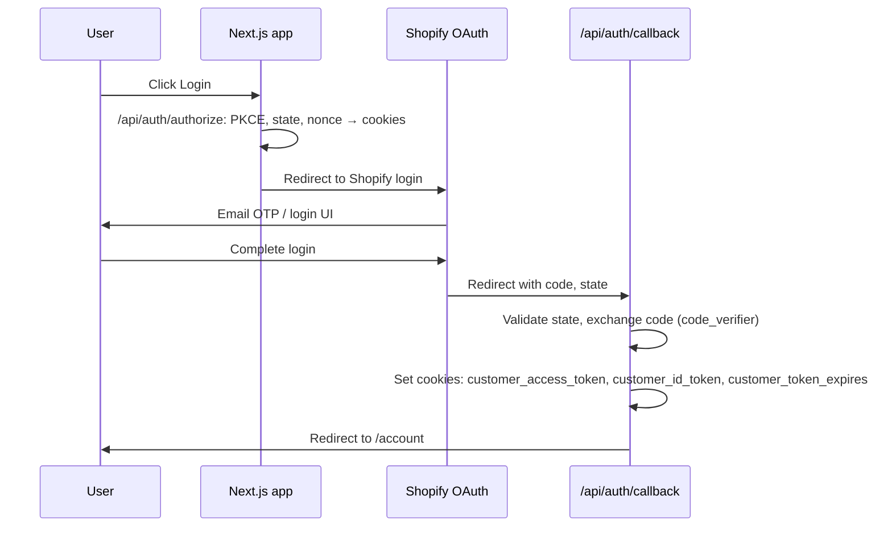

# Customer Portal (Account)

Concise overview of the customer/account portal: authentication, subscriptions, profile, and how Shopify and Loop work together.

## Purpose and stack

The account portal lets customers:

- View and edit **profile** (name, email, address)
- View **order history**
- View **subscriptions** and perform **subscription actions** (pause, resume, cancel, skip, change plan/frequency)

**Stack:**

- **Shopify:** Product catalog, cart, hosted checkout, **customer identity** (OAuth via Customer Account API), and the **list of subscription contracts** per customer. Checkout and first-order payment happen on Shopify.
- **Loop:** Subscription lifecycle and recurring billing. Loop is the **source of truth** for subscription state (product, price, interval, next billing date, fulfillment flags). All subscription **mutations** (pause, resume, cancel, skip, change plan) go through the Loop Admin API; Loop syncs back to Shopify.

So: **Shopify = who the customer is + which contracts they have; Loop = what each subscription actually is and what happens when they click Pause / Edit / etc.**

## Authentication flow

Login uses **Shopify Customer Account API** (OAuth 2.0 with PKCE). Session is stored in HTTP-only cookies.

- **Login:** User hits a “Log in” link → `window.location.href = '/api/auth/authorize'`. [`app/api/auth/authorize/route.ts`](../app/api/auth/authorize/route.ts) generates PKCE `code_verifier` / `code_challenge`, `state`, and `nonce`, stores them in cookies, then redirects to Shopify’s authorization URL.
- **Callback:** After Shopify login, Shopify redirects to `/api/auth/callback` with `code` and `state`. [`app/api/auth/callback/route.ts`](../app/api/auth/callback/route.ts) validates `state`, exchanges `code` for tokens using `code_verifier`, then sets cookies and redirects to `/account`.
- **Session:** The app calls `GET /api/auth/session` to see if the user is logged in. [`app/api/auth/session/route.ts`](../app/api/auth/session/route.ts) reads the `customer_access_token` cookie and (if present) fetches the customer profile from Shopify Customer Account API GraphQL (`https://shopify.com/{shopId}/account/customer/api/...`). Session response includes `authenticated` and `customer` (id, email, firstName, lastName, defaultAddress, etc.).
- **Logout:** `GET /api/auth/logout` clears the auth cookies and can redirect to Shopify’s SSO logout URL.

**Key files:**

- [`app/context/AuthContext.tsx`](../app/context/AuthContext.tsx) — `checkSession()` calls `/api/auth/session`; `login()` redirects to `/api/auth/authorize`; `logout()` redirects to `/api/auth/logout`. Exposes `customer`, `loading`, `isAuthenticated`, `logout`, `login`, `checkSession`.

## Subscription data flow

### Reading subscriptions

1. **Who has which contracts:** The backend uses the **Shopify** Customer Account API (with the customer’s access token from the cookie) to load `customer { subscriptionContracts(first: 50) { nodes { id, status, ... } } }`. This returns only the logged-in customer’s subscription contract IDs and basic fields.
2. **Current state from Loop:** For each contract, the backend calls **Loop** Admin API with ID `shopify-{numericId}` (e.g. `shopify-126077600118`) to get the real subscription details: product, variant, price, interval, next billing date, fulfillment flags (`completedOrdersCount`, `hasUnfulfilledOrder`, etc.).
3. **Merged list:** The response is a single list of subscriptions: Shopify provides the association “this customer has these contracts”; Loop provides the accurate state for each. If Loop fails for a contract, the route falls back to Shopify-only data for that item.

**API:** `GET /api/auth/subscriptions` (credentials / cookie required). Implemented in [`app/api/auth/subscriptions/route.ts`](../app/api/auth/subscriptions/route.ts). The frontend calls this via `useSubscriptions().fetchSubscriptions()` from [`app/hooks/useSubscriptions.ts`](../app/hooks/useSubscriptions.ts).

### Mutations (pause, resume, cancel, skip, change plan)

All subscription actions go through **one** route: `POST /api/auth/subscriptions/[id]/pause`. The request body specifies the action:

- `{ action: 'pause' }`
- `{ action: 'resume' }`
- `{ action: 'cancel', reason?: string }`
- `{ action: 'skip' }`
- `{ action: 'change-frequency', plan: 'starter' | 'pro' | 'max', protocolId?: '1'|'2'|'3'|'4' }`

The `[id]` is the Shopify subscription contract ID (GID like `gid://shopify/SubscriptionContract/126077600118` or numeric `126077600118`). The route converts it to Loop’s format `shopify-{numericId}` and calls the Loop Admin API. No Shopify mutation is used for these actions.

**Implementation:** [`app/api/auth/subscriptions/[id]/pause/route.ts`](../app/api/auth/subscriptions/[id]/pause/route.ts). Loop client helpers live in [`app/lib/loop.ts`](../app/lib/loop.ts).

## Plan change (change-frequency)

When a user clicks “Edit” on a subscription and selects a different tier (e.g. Starter → Max) or protocol, the frontend calls `changePlan(subscriptionId, plan, protocolId)` from `useSubscriptions`, which sends:

- `POST /api/auth/subscriptions/[id]/pause`
- Body: `{ action: 'change-frequency', plan, protocolId? }`

Backend flow:

1. Load the subscription from Loop (`GET /subscription/shopify-{id}`) to get the first line and its `variantShopifyId`.
2. Resolve **target variant**: if `protocolId` is provided, use it; otherwise infer from current variant via `VARIANT_TO_PROTOCOL`. Then look up `PROTOCOL_VARIANTS[protocolId][plan]` to get the target variant ID (e.g. monthly tier = different variant than weekly).
3. Get plan config from `PLAN_CONFIGURATIONS[plan]` (name, interval, **sellingPlanId**, quantity).
4. Call Loop: `PUT /subscription/{loopId}/line/{lineId}/swap` with:
   - `variantShopifyId`: target variant
   - `quantity`: from plan config
   - `pricingType: 'OLD'` (keep existing discount)
   - `sellingPlanGroupId`: `parseInt(planConfig.sellingPlanId, 10)` (e.g. `711429980534` for Max/monthly)

So the **target** plan’s selling plan ID is sent. Variant and selling plan are both updated in one swap call.

## Profile and orders

- **Profile:** The account dashboard ([`app/account/page.tsx`](../app/account/page.tsx)) has an “Edit Profile” modal. On save it POSTs to `/api/auth/customer/update` with JSON body (firstName, lastName, email, phone, address). **Note:** The update route [`app/api/auth/customer/update/route.ts`](../app/api/auth/customer/update/route.ts) currently expects `Authorization: Bearer <token>`. The account page uses `credentials: 'include'` and does not send the token in the header; other auth routes in this app read the access token from the **cookie** server-side. If profile update fails with 401, the update route may need to be aligned to read the token from the same cookie.
- **Orders:** Order count and list come from `GET /api/auth/orders`, which uses the Customer Account API with the same access token (from cookie) to fetch the customer’s orders.

## What is not in the portal

- **Payment method / card update:** There is no UI or API in the bespoke portal for updating the payment method on file. The legacy Shopify customer portal (e.g. theme or Shopify’s built-in account area) previously allowed this; the current custom site does not.

---

## Known issues / solution angles

### Problem 1: Weekly → monthly upgrade charged at weekly rate

**Reported behaviour:** A customer upgraded their subscription from a weekly plan to a monthly plan. In Shopify/Loop, the **Loop weekly subscription** was still applied to the now larger monthly cost — i.e. it was treated as if it were still the small trial/weekly pack (wrong amount).

**Current implementation:** The change-frequency flow sends the **target** plan’s selling plan ID (e.g. `711429980534` for Max/monthly) as `sellingPlanGroupId` in the Loop swap request, and the correct target **variant** for the new tier. So the backend intends to switch both variant and selling plan to the new tier.

**Possible causes to investigate:**

1. **Loop or Shopify applying the original contract’s selling plan** to the new variant after swap (e.g. contract-level selling plan not updated, or first charge after swap still using old plan).
2. **`sellingPlanGroupId` vs specific `sellingPlanId`** — Loop API semantics: whether “group” means the billing interval group or a specific plan within it, and whether the correct plan is being selected for the new variant.
3. **Timing / sync** — Next billing run might still use the previous plan if Loop/Shopify sync is delayed or if “effective date” is next cycle without updating the selling plan on the contract.
4. **Variant–selling-plan association in Shopify** — The monthly variant must be tied to the monthly selling plan in Shopify; if the variant is only associated with weekly plans, Loop might fall back to the contract’s existing plan.

No code change is made here; this section is to focus follow-up investigation and fixes.

### Problem 2: Update payment method

The portal has no “Update payment method” or “Update card” flow. Users cannot change the payment details attached to their account/subscription from this site.

**Options for future implementation:**

1. **Shopify Customer Account API / Storefront API** — Confirm whether Shopify exposes any mutation or hosted URL for updating the payment method on a subscription or customer account.
2. **Loop** — Check if Loop provides a customer-facing portal or Admin API for updating payment method; some subscription platforms expose a hosted “update payment” link or tokenized form.
3. **Redirect to Shopify-hosted manage page** — If Shopify has a hosted “manage subscription” or “account” page that supports card update, add a link from the portal that opens that page (same login/session).
4. **Link to Loop customer portal** — If Loop offers a customer portal with payment update, link to it from the account or subscription section (with appropriate auth or token).

No implementation in this doc; listing options for when you add the feature.

---

## Key file reference

| Area | File |
|------|------|
| Auth context | [`app/context/AuthContext.tsx`](../app/context/AuthContext.tsx) |
| Subscriptions hook | [`app/hooks/useSubscriptions.ts`](../app/hooks/useSubscriptions.ts) |
| Account dashboard | [`app/account/page.tsx`](../app/account/page.tsx) |
| Subscriptions list & actions | [`app/account/subscriptions/page.tsx`](../app/account/subscriptions/page.tsx) |
| Edit plan modal | [`app/components/subscriptions/EditSubscriptionModal.tsx`](../app/components/subscriptions/EditSubscriptionModal.tsx) |
| GET subscriptions (hybrid) | [`app/api/auth/subscriptions/route.ts`](../app/api/auth/subscriptions/route.ts) |
| All subscription actions | [`app/api/auth/subscriptions/[id]/pause/route.ts`](../app/api/auth/subscriptions/[id]/pause/route.ts) |
| Loop API client | [`app/lib/loop.ts`](../app/lib/loop.ts) |
| Plan/variant config (pause route) | `PROTOCOL_VARIANTS`, `PLAN_CONFIGURATIONS` in pause route above |
| Subscription types | [`app/types/subscription.ts`](../app/types/subscription.ts) |
