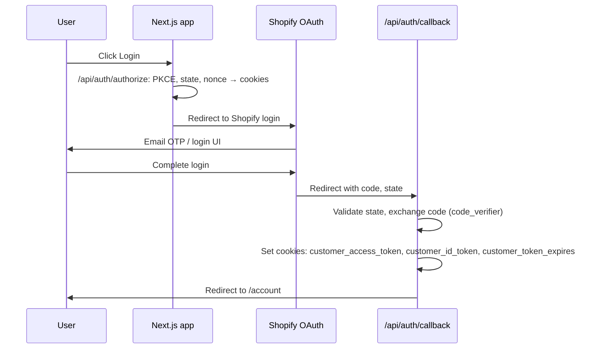

# Customer Portal (Account)

Concise overview of the customer/account portal: authentication, subscriptions, profile, and how Shopify and Loop work together.

## Purpose and stack

The account portal lets customers:

- View and edit **profile** (name, email, address)
- View **order history**
- View **subscriptions** and perform **subscription actions** (pause, resume, cancel, skip, change plan/frequency)

**Stack:**

- **Shopify:** Product catalog, cart, hosted checkout, **customer identity** (OAuth via Customer Account API), and the **list of subscription contracts** per customer. Checkout and first-order payment happen on Shopify.
- **Loop:** Subscription lifecycle and recurring billing. Loop is the **source of truth** for subscription state (product, price, interval, next billing date, fulfillment flags). All subscription **mutations** (pause, resume, cancel, skip, change plan) go through the Loop Admin API; Loop syncs back to Shopify.

So: **Shopify = who the customer is + which contracts they have; Loop = what each subscription actually is and what happens when they click Pause / Edit / etc.**

## Authentication flow

Login uses **Shopify Customer Account API** (OAuth 2.0 with PKCE). Session is stored in HTTP-only cookies.

- **Login:** User hits a “Log in” link → `window.location.href = '/api/auth/authorize'`. [`app/api/auth/authorize/route.ts`](../app/api/auth/authorize/route.ts) generates PKCE `code_verifier` / `code_challenge`, `state`, and `nonce`, stores them in cookies, then redirects to Shopify’s authorization URL.
- **Callback:** After Shopify login, Shopify redirects to `/api/auth/callback` with `code` and `state`. [`app/api/auth/callback/route.ts`](../app/api/auth/callback/route.ts) validates `state`, exchanges `code` for tokens using `code_verifier`, then sets cookies and redirects to `/account`.
- **Session:** The app calls `GET /api/auth/session` to see if the user is logged in. [`app/api/auth/session/route.ts`](../app/api/auth/session/route.ts) reads the `customer_access_token` cookie and (if present) fetches the customer profile from Shopify Customer Account API GraphQL (`https://shopify.com/{shopId}/account/customer/api/...`). Session response includes `authenticated` and `customer` (id, email, firstName, lastName, defaultAddress, etc.).
- **Logout:** `GET /api/auth/logout` clears the auth cookies and can redirect to Shopify’s SSO logout URL.

**Key files:**

- [`app/context/AuthContext.tsx`](../app/context/AuthContext.tsx) — `checkSession()` calls `/api/auth/session`; `login()` redirects to `/api/auth/authorize`; `logout()` redirects to `/api/auth/logout`. Exposes `customer`, `loading`, `isAuthenticated`, `logout`, `login`, `checkSession`.

### Local / preview and redirect URI

Shopify Customer Account API **does not allow** `localhost` or any `http` URL in the callback allowlist (Headless → storefront → Customer Account API → Application setup → Callback URI(s)). Only HTTPS URLs (e.g. production, or an ngrok URL) can be added.

- **Production:** Use your live domain (e.g. `https://conka.io/api/auth/callback`, `https://www.conka.io/api/auth/callback`) in the allowlist. No env needed.
- **Local dev:** To get login working from localhost, use a tunnel (e.g. ngrok) and add the tunnel’s HTTPS callback URL in Shopify. Then set **`SHOPIFY_REDIRECT_URI`** (or **`NEXT_PUBLIC_APP_URL`**) in `.env.local` to that base URL (e.g. `https://abc123.ngrok.io`). The app will send this as the `redirect_uri` to Shopify so the OAuth callback goes to your tunnel (which forwards to localhost).
- **Preview (Vercel):** Each preview deploy gets a new URL. You can add that URL once in Shopify when you need to test that deploy, or use a **stable preview domain** (Vercel → Project → Settings → Domains) and add that single URL in Shopify.

If login “used to work” locally and then stopped, the app was likely previously using a single env-based redirect (e.g. production URL). That meant the callback was hitting production, not localhost. The code was changed to send the actual request origin so production/preview use the correct URL; that exposed that localhost isn’t allowed. The env override above restores the ability to point `redirect_uri` at an allowed URL (production or ngrok) when running in non-production.

### Dev mock sign-in (local refactors)

To work on the account portal UI without Shopify OAuth (e.g. no ngrok, no real login):

1. In `.env.local` set:
   - `DEV_MOCK_AUTH=true` (server: enables mock session and protected-route bypass)
   - `NEXT_PUBLIC_DEV_MOCK_AUTH=true` (client: shows "Use mock account" on the login page)
2. Restart the dev server.
3. Open `/account/login` and click **Use mock account (dev)**. The app sets a `dev_mock_auth` cookie and redirects to `/account`. Session and protected routes (`/api/auth/session`, `/api/auth/subscriptions`, `/api/auth/orders`) treat the request as authenticated and return mock/empty data (no Shopify or Loop calls).
4. Sign out clears the mock cookie; you can use mock again from the login page.

Mock is only active when `NODE_ENV === 'development'` and `DEV_MOCK_AUTH === 'true'`. Do not set these in production.

**API:** `POST /api/auth/dev-mock` sets the cookie; `DELETE /api/auth/dev-mock` clears it. Both return 403 when mock auth is not enabled.

## Subscription data flow

### Reading subscriptions

1. **Who has which contracts:** The backend uses the **Shopify** Customer Account API (with the customer’s access token from the cookie) to load `customer { subscriptionContracts(first: 50) { nodes { id, status, ... } } }`. This returns only the logged-in customer’s subscription contract IDs and basic fields.
2. **Current state from Loop:** For each contract, the backend calls **Loop** Admin API with ID `shopify-{numericId}` (e.g. `shopify-126077600118`) to get the real subscription details: product, variant, price, interval, next billing date, fulfillment flags (`completedOrdersCount`, `hasUnfulfilledOrder`, etc.).
3. **Merged list:** The response is a single list of subscriptions: Shopify provides the association “this customer has these contracts”; Loop provides the accurate state for each. If Loop fails for a contract, the route falls back to Shopify-only data for that item.

**API:** `GET /api/auth/subscriptions` (credentials / cookie required). Implemented in [`app/api/auth/subscriptions/route.ts`](../app/api/auth/subscriptions/route.ts). The frontend calls this via `useSubscriptions().fetchSubscriptions()` from [`app/hooks/useSubscriptions.ts`](../app/hooks/useSubscriptions.ts).

### Mutations (pause, resume, cancel, skip, change plan)

All subscription actions go through **one** route: `POST /api/auth/subscriptions/[id]/pause`. The request body specifies the action:

- `{ action: 'pause' }`
- `{ action: 'resume' }`
- `{ action: 'cancel', reason?: string }`
- `{ action: 'skip' }`
- `{ action: 'change-frequency', plan: 'starter' | 'pro' | 'max', protocolId?: '1'|'2'|'3'|'4' }`

The `[id]` is the Shopify subscription contract ID (GID like `gid://shopify/SubscriptionContract/126077600118` or numeric `126077600118`). The route converts it to Loop’s format `shopify-{numericId}` and calls the Loop Admin API. No Shopify mutation is used for these actions.

**Implementation:** [`app/api/auth/subscriptions/[id]/pause/route.ts`](../app/api/auth/subscriptions/[id]/pause/route.ts). Loop client helpers live in [`app/lib/loop.ts`](../app/lib/loop.ts).

## Plan change (change-frequency)

When a user clicks “Edit” on a subscription and selects a different tier (e.g. Starter → Max) or protocol, the frontend calls `changePlan(subscriptionId, plan, protocolId)` from `useSubscriptions`, which sends:

- `POST /api/auth/subscriptions/[id]/pause`
- Body: `{ action: 'change-frequency', plan, protocolId? }`

Backend flow:

1. Load the subscription from Loop (`GET /subscription/shopify-{id}`) to get the first line and its `variantShopifyId`.
2. Resolve **target variant**: if `protocolId` is provided, use it; otherwise infer from current variant via `VARIANT_TO_PROTOCOL`. Then look up `PROTOCOL_VARIANTS[protocolId][plan]` to get the target variant ID (e.g. monthly tier = different variant than weekly).
3. Get plan config from `PLAN_CONFIGURATIONS[plan]` (name, interval, **sellingPlanId**, quantity).
4. Call Loop: `PUT /subscription/{loopId}/line/{lineId}/swap` with:
   - `variantShopifyId`: target variant
   - `quantity`: from plan config
   - `pricingType: 'OLD'` (keep existing discount)
   - `sellingPlanGroupId`: `parseInt(planConfig.sellingPlanId, 10)` (e.g. `711429980534` for Max/monthly)

So the **target** plan’s selling plan ID is sent. Variant and selling plan are both updated in one swap call.

## Profile and orders

- **Profile:** The account dashboard ([`app/account/page.tsx`](../app/account/page.tsx)) has an “Edit Profile” modal. On save it POSTs to `/api/auth/customer/update` with JSON body (firstName, lastName, email, phone, address). **Note:** The update route [`app/api/auth/customer/update/route.ts`](../app/api/auth/customer/update/route.ts) currently expects `Authorization: Bearer <token>`. The account page uses `credentials: 'include'` and does not send the token in the header; other auth routes in this app read the access token from the **cookie** server-side. If profile update fails with 401, the update route may need to be aligned to read the token from the same cookie.
- **Orders:** Order count and list come from `GET /api/auth/orders`, which uses the Customer Account API with the same access token (from cookie) to fetch the customer’s orders.

## What is not in the portal

- **Payment method / card update:** There is no UI or API in the bespoke portal for updating the payment method on file. The legacy Shopify customer portal (e.g. theme or Shopify’s built-in account area) previously allowed this; the current custom site does not.

---

## Old theme and two portals

You are on a **headless** site (this repo); the **old Shopify theme is still live** on your myshopify.com domain (e.g. `conka-6770.myshopify.com`). That creates two “customer portal” surfaces:

1. **Shopify customer account** — Orders, profile, addresses. In headless we replicate this via Customer Account API (login, session, profile, orders).
2. **Loop customer portal** — Subscription management (pause, skip, change plan, **change payment method**). Loop’s portal is served at `https://conka-6770.myshopify.com/a/loop_subscriptions/customer-portal`, so it runs **on the old theme**. Users who open it see the legacy theme, not the new headless site.

**Is the old theme being live an issue?**

- **Confusion:** Customers can end up in two places (new site account vs Loop portal on old theme). Logs may show “via Customer Portal” when they used the Loop portal on the old theme (e.g. “Order skipped via Customer Portal”).
- **Brand/UX:** The old theme is off-brand compared to the new site; you already removed redirects to the Loop portal from the new site for that reason.
- **Redirects:** If you redirect `*.myshopify.com` → conka.io, you must **exclude** `/a/loop_subscriptions/` so Loop’s portal still loads; otherwise subscription management (and payment update) on the old URL would break.

**Recommendation:**

- **Goal:** Make the **new website account section the single place** for both “Shopify account” and “Loop subscription” actions (one login, one UI).
- **Short term:** Keep the old theme live only if you still need it for Loop’s portal (e.g. payment method update) until you implement that on the new site or link to Loop in a controlled way (see “Update payment method — where it lives” below). You can discourage or remove links to the old theme from the new site so most traffic is on headless.
- **Once parity is achieved:** Implement or link “Update payment method” from the new site and fix the plan-change billing bug so the new site fully replaces the need for the Loop portal on the old theme. Then you can consider **unpublishing or redirecting the old theme** so only the headless site serves the brand; Loop’s backend will still work because it’s API-driven and does not depend on the theme being live.

---

## Known issues / solution angles

### Problem 1: Weekly → monthly upgrade charged at weekly rate

**Reported behaviour:** A customer upgraded their subscription from a weekly plan to a monthly plan. In Shopify/Loop, the **Loop weekly subscription** was still applied to the now larger monthly cost — i.e. it was treated as if it were still the small trial/weekly pack (wrong amount).

**Evidence from Shopify admin logs:** The line was successfully swapped (e.g. "Protocol: Conka Balance - Starter - 4 x 1 @ £11.99 was swapped with Protocol: Conka Balance - Max - 28 x 1 @ £63.99 via API"). So the **variant and price** did update. Despite that, the **Loop plan** (billing interval / selling plan) effectively remained the same for billing.

**Likely cause:** Loop may not be applying the `sellingPlanGroupId` from the swap to the contract's billing interval. A separate "change frequency" or "change plan" call may be required after (or instead of) swap.

**Next steps:** (1) In Loop's Admin API, verify whether swap line updates billing interval or only variant/price, and whether a change-frequency endpoint exists. (2) If needed, add a second API call after swap to update billing interval. (3) Confirm with Loop whether `sellingPlanGroupId` on swap is a group vs a single plan.

**Where we go wrong (edit-order / plan-change flow)**

Comparison of what our new account portal does vs what Loop's model and API support:

| Layer | What we do | What we don't do |
|-------|------------|------------------|
| **EditSubscriptionModal** | Lets user pick protocol (1-4) and tier (starter / pro / max). UI labels tier as "Select Frequency" (Weekly / Bi-Weekly / Monthly). On Save it only calls `onSave(selectedProtocol, selectedTier)` — i.e. it sends protocolId and plan (tier) only. | No distinction between "change product/variant" and "change billing/delivery schedule". The modal conflates tier with frequency in one selection. |
| **useSubscriptions.changePlan** | Sends one request: `POST .../pause` with body `{ action: 'change-frequency', plan, protocolId? }`. | Does not call any other endpoint (e.g. no separate "update frequency" or "change plan" call). |
| **Pause route (change-frequency)** | GET subscription from Loop; resolve target variant from PROTOCOL_VARIANTS and plan config (sellingPlanId) from PLAN_CONFIGURATIONS; call **only** Loop `PUT .../line/{lineId}/swap` with variantShopifyId, quantity, pricingType, sellingPlanGroupId. Fallback when variant unknown: `POST .../change-plan` with sellingPlanId. | For the normal path (known variant), we **never** call Loop's **Update frequency** or **Change subscription plan** APIs. We assume swap line with sellingPlanGroupId is enough to change both product and billing/delivery schedule. |
| **app/lib/loop.ts** | Defines `updateSubscriptionFrequency(subscriptionId, interval)` which calls Loop `POST /subscription/{id}/change-frequency` with billingInterval, deliveryInterval, etc. | This function is **never used** by the pause route or any account-portal flow. |

Loop admin preferences distinguish **Edit billing/delivery schedule** (recalculate discount per updated interval) from **Edit/Remove products**. So in Loop's model, editing the billing/delivery schedule is a **separate** action. We only do a **product swap** and do not perform that step. Loop may leave the subscription's billing interval (e.g. weekly) unchanged when we only swap the line. The fix is to align with Loop: call **update frequency** (or equivalent) after a successful swap so the subscription's billing/delivery schedule matches the new tier, or use Loop's **change subscription plan** API instead of or in addition to swap.

### Problem 2: Update payment method

The portal has no “Update payment method” or “Update card” flow. Users cannot change the payment details attached to their account/subscription from this site.

**Update payment method — where it lives**

- **Loop (Loop Work):** Loop's **customer portal** supports "Change payment methods" and "Update payment method from customer portal" (see [Loop Help: Customer portal](https://help.loopwork.co/en/collections/16281691-customer-portal)). That portal is at `https://conka-6770.myshopify.com/a/loop_subscriptions/customer-portal` (served on your **old theme**). So today, **payment method update is a Loop feature**, available when the customer uses Loop's portal on the old theme.
- **Shopify:** The Customer Account UI Extensions have an **intent** to open the subscription payment method flow: `open:shopify/SubscriptionContract,{id}?field=paymentMethod` (see [Shopify Intents](https://shopify.dev/docs/api/customer-account-ui-extensions/latest/apis/intents)). That is for apps running inside Shopify's customer account UI. For a headless site, you would need either a hosted page that uses that intent or an API that supports updating the payment method.

**Concrete next steps**

1. **Quick win — link from the new site to Loop's portal for payment update only:** Add an "Update payment method" or "Update card" link on the account or subscriptions page that opens `https://conka-6770.myshopify.com/a/loop_subscriptions/customer-portal` in a new tab (or same tab with a return link). The customer logs in on the old theme if needed. This restores the ability to update the card without building a custom flow. Label it clearly (e.g. "Update payment method (opens subscription manager)").
2. **Loop Admin API:** Check [Loop's API docs](https://developer.loopwork.co/reference/) (or Loop support) for an **update payment method** endpoint (e.g. per customer or per subscription). If they expose a hosted "update payment" URL (e.g. a tokenized link per customer/subscription), you could link to that from the new site so the experience stays on-brand while still using Loop for PCI.
3. **Shopify headless:** If you need payment update to stay entirely on the new domain, confirm with Shopify whether the Customer Account API (or a hosted account page) supports opening the subscription payment method flow from a headless app (e.g. redirect or iframe to Shopify with the subscription contract ID and `field=paymentMethod`).

---

## Key file reference

| Area | File |
|------|------|
| Auth context | [`app/context/AuthContext.tsx`](../app/context/AuthContext.tsx) |
| Subscriptions hook | [`app/hooks/useSubscriptions.ts`](../app/hooks/useSubscriptions.ts) |
| Account dashboard | [`app/account/page.tsx`](../app/account/page.tsx) |
| Subscriptions list & actions | [`app/account/subscriptions/page.tsx`](../app/account/subscriptions/page.tsx) |
| Edit plan modal | [`app/components/subscriptions/EditSubscriptionModal.tsx`](../app/components/subscriptions/EditSubscriptionModal.tsx) |
| GET subscriptions (hybrid) | [`app/api/auth/subscriptions/route.ts`](../app/api/auth/subscriptions/route.ts) |
| All subscription actions | [`app/api/auth/subscriptions/[id]/pause/route.ts`](../app/api/auth/subscriptions/[id]/pause/route.ts) |
| Loop API client | [`app/lib/loop.ts`](../app/lib/loop.ts) |
| Plan/variant config (pause route) | `PROTOCOL_VARIANTS`, `PLAN_CONFIGURATIONS` in pause route above |
| Subscription types | [`app/types/subscription.ts`](../app/types/subscription.ts) |
