# Customer Portal (Account)

Concise overview of the customer/account portal: authentication, subscriptions, profile, and how Shopify and Loop work together.

## Purpose and stack

The account portal lets customers:

- View and edit **profile** (name, email, address)
- View **order history**
- View **subscriptions** and perform **subscription actions** (pause, resume, cancel, skip, change plan/frequency, update payment method)

**Stack:**

- **Shopify:** Product catalog, cart, hosted checkout, **customer identity** (OAuth via Customer Account API), and the **list of subscription contracts** per customer.
- **Loop:** Subscription lifecycle and recurring billing. Loop is the **source of truth** for subscription state (product, price, interval, next billing date, fulfillment flags). All subscription **mutations** go through the Loop Admin API; Loop syncs back to Shopify.

**Shopify = who the customer is + which contracts they have. Loop = what each subscription actually is and what happens when they interact with it.**

---

## Authentication flow

Login uses **Shopify Customer Account API** (OAuth 2.0 with PKCE). Session is stored in HTTP-only cookies.

```mermaid
sequenceDiagram
  participant User
  participant App as Next.js app
  participant Shopify as Shopify OAuth
  participant Callback as /api/auth/callback

  User->>App: Click Login
  App->>App: /api/auth/authorize: PKCE, state, nonce → cookies
  App->>Shopify: Redirect to Shopify login
  Shopify->>User: Email OTP / login UI
  User->>Shopify: Complete login
  Shopify->>Callback: Redirect with code, state
  Callback->>Callback: Validate state, exchange code (code_verifier)
  Callback->>Callback: Set cookies: customer_access_token, customer_id_token, customer_token_expires
  Callback->>User: Redirect to /account
```



- **Login:** `window.location.href = '/api/auth/authorize'` → generates PKCE, redirects to Shopify.
- **Callback:** `/api/auth/callback` validates state, exchanges code for tokens, sets cookies, redirects to `/account`.
- **Session:** `GET /api/auth/session` reads the `customer_access_token` cookie and fetches customer profile from Shopify. Returns `authenticated` and `customer` (id, email, firstName, lastName, defaultAddress).
- **Logout:** `GET /api/auth/logout` clears auth cookies.

**Key files:**

- [`app/context/AuthContext.tsx`](../app/context/AuthContext.tsx) — exposes `customer`, `loading`, `isAuthenticated`, `logout`, `login`, `checkSession`.

---

## Testing Shopify auth on a preview branch

Shopify Customer Account API **does not allow** `localhost` or `http` URLs as callback URIs. You cannot test the OAuth login flow on a local dev server directly.

**The solution: use your Vercel branch preview URL.**

Every branch pushed to Vercel gets a stable URL in the format:

```
https://{project}-git-{branch-name}-{team}.vercel.app
```

This URL stays the same for the lifetime of the branch regardless of how many times you push. Use this — not the per-deployment URL (which changes on every push).

### Steps

**1. Find your branch URL**

In Vercel → Deployments, find your branch deployment and look under **Domains** for the URL containing your branch name:

```
conka-shopify-git-your-branch-name-conka.vercel.app
```

**2. Add it to Shopify**

In Shopify → Headless → Customer Account API → Application setup:

- **Callback URI(s):** `https://{your-branch-url}/api/auth/callback`
- **Javascript origin(s):** `https://{your-branch-url}`

Hit **Save**.

**3. Set the environment variable in Vercel**

In Vercel → Settings → Environment Variables:

| Key                   | Value                       | Environment |
| --------------------- | --------------------------- | ----------- |
| `NEXT_PUBLIC_APP_URL` | `https://{your-branch-url}` | Preview     |

Scope it to your specific branch if possible. Trigger a redeploy so the variable is picked up.

**4. Test**

Open `https://{your-branch-url}/account` in your browser. Login completes via Shopify OAuth and redirects back to your preview URL. Monitor live logs in Vercel → Deployments → Functions.

**5. Cleanup**

When the branch is merged, remove the callback URI from Shopify to keep the allowlist clean.

### Dev mock sign-in (UI-only local development)

To work on the account portal UI without Shopify OAuth:

1. In `.env.local` set:
   - `DEV_MOCK_AUTH=true`
   - `NEXT_PUBLIC_DEV_MOCK_AUTH=true`
2. Restart the dev server.
3. Open `/account/login` and click **Use mock account (dev)**. Session and protected routes return mock/empty data — no Shopify or Loop calls.
4. Sign out clears the mock cookie.

Mock is only active when `NODE_ENV === 'development'` and `DEV_MOCK_AUTH === 'true'`. Never set in production.

---

## Subscription data flow

### Reading subscriptions

1. **Shopify** Customer Account API returns the logged-in customer's subscription contract IDs via `customer { subscriptionContracts(first: 50) }`.
2. **Loop** Admin API is called for each contract using `shopify-{numericId}` format to get real subscription details: product, variant, price, interval, next billing date, lines, fulfillment flags.
3. The merged response is returned as a single list. If Loop fails for a contract, the route falls back to Shopify-only data.

**API:** `GET /api/auth/subscriptions` — [`app/api/auth/subscriptions/route.ts`](../app/api/auth/subscriptions/route.ts)

### Subscription actions

All mutations go through one route: `POST /api/auth/subscriptions/[id]/pause`

| Action      | Body                                                                                                 |
| ----------- | ---------------------------------------------------------------------------------------------------- |
| Pause       | `{ action: 'pause' }`                                                                                |
| Resume      | `{ action: 'resume' }`                                                                               |
| Cancel      | `{ action: 'cancel', reason?: string }`                                                              |
| Skip        | `{ action: 'skip' }`                                                                                 |
| Change plan | `{ action: 'change-frequency', plan: 'starter' \| 'pro' \| 'max', protocolId?: '1'\|'2'\|'3'\|'4' }` |

The `[id]` is the Shopify subscription contract ID (GID or numeric). The route converts it to Loop's `shopify-{numericId}` format.

**Implementation:** [`app/api/auth/subscriptions/[id]/pause/route.ts`](../app/api/auth/subscriptions/[id]/pause/route.ts)

---

## Plan change (change-frequency)

### How it works

When a customer changes tier or protocol, the backend performs **two sequential Loop API calls**. Both must succeed — if either fails the customer sees an error and is directed to contact support.

**Step 1 — Swap line:**

```
PUT /admin/2023-10/subscription/shopify-{id}/line/{lineId}/swap
```

Updates the product variant and price. Uses `PROTOCOL_VARIANTS` to resolve the target variant ID and `PLAN_CONFIGURATIONS` for the `sellingPlanGroupId`.

**Step 2 — Update frequency:**

```
PUT /admin/2023-10/subscription/{loopInternalId}/frequency
```

Updates the billing and delivery interval. Uses Loop's **internal numeric ID** (e.g. `10547807`) — **not** the `shopify-{id}` format. This ID is extracted from the Step 1 GET response (`subscriptionData.data.id`).

Body:

```json
{
  "billingPolicy": { "interval": "WEEK", "intervalCount": 2 },
  "deliveryPolicy": { "interval": "WEEK", "intervalCount": 2 },
  "nextBillingDateEpoch": 1234567890,
  "discountType": "OLD"
}
```

Interval must be `WEEK`, `MONTH`, or `YEAR` — Loop does not accept `DAY`. Bi-weekly = `WEEK` × 2.

**Important:** Step 2 uses the Loop internal ID, not the Shopify-prefixed ID. This is a known gotcha — the frequency endpoint returns 404 if you pass `shopify-{id}`.

### Verified product and plan mappings

These are verified against Shopify and must be kept in sync if products change.

**`PROTOCOL_VARIANTS`**

| Protocol       | Tier    | Variant ID     | SKU                  |
| -------------- | ------- | -------------- | -------------------- |
| 1 — Resilience | starter | 56999240597878 | RESILIANCE_STARTER_4 |
| 1 — Resilience | pro     | 56999240630646 | RESILIANCE_PRO_12    |
| 1 — Resilience | max     | 56999240663414 | RESILIANCE_MAX_28    |
| 2 — Precision  | starter | 56999234503030 | PRECISION_STARTER_4  |
| 2 — Precision  | pro     | 56999234535798 | PRECISION_PRO_12     |
| 2 — Precision  | max     | 56999234568566 | PRECISION_MAX_28     |
| 3 — Balance    | starter | 56998884573558 | BALANCED_STARTER_4   |
| 3 — Balance    | pro     | 56998884606326 | BALANCED_PRO_12      |
| 3 — Balance    | max     | 56998884639094 | BALANCED_MAX_28      |
| 4 — Ultimate   | pro     | 56999249478006 | ULTAMATE_PRO_28      |
| 4 — Ultimate   | max     | 56999249510774 | ULTAMATE_MAX_56      |
| flow           | starter | 57000187363702 | FLOW_TRIAL_4         |
| flow           | pro     | 56999967752566 | FLOW_TRIAL_12        |
| flow           | max     | 56999967818102 | FLOW_TRIAL_28        |
| clear          | starter | 57000418607478 | CLEATR_TRIAL_4       |
| clear          | pro     | 57000418673014 | CLEAR_TRIAL_12       |
| clear          | max     | 57000418705782 | CLEAR_TRIAL_28       |

**`PLAN_CONFIGURATIONS`**

| Plan    | Interval  | SellingPlanId | SellingPlanGroupId |
| ------- | --------- | ------------- | ------------------ |
| starter | WEEK × 1  | 711429882230  | 98722480502        |
| pro     | WEEK × 2  | 711429947766  | 98722546038        |
| max     | MONTH × 1 | 711429980534  | 98722578806        |

### Edit plan modal

The modal behaviour is driven by **subscription type** (derived from the subscription's product title):

| Type                                                    | What can change                                      | Boundary                                   |
| ------------------------------------------------------- | ---------------------------------------------------- | ------------------------------------------ |
| **Protocol** (Resilience, Precision, Balance, Ultimate) | Switch protocol and/or pack size (starter/pro/max)   | Cannot switch to Flow/Clear single formula |
| **Flow or Clear** (single formula)                      | Switch formula and/or pack size (4, 8, 12, 28 shots) | Cannot switch to a protocol bundle         |

Crossing the boundary (protocol ↔ single formula) is not supported in the modal. The UI states this clearly and directs the customer to cancel and start a new subscription from the shop.

### Multi-line subscriptions

A single Loop subscription contract can contain multiple product lines but only one billing frequency. If a subscription has more than one line:

- The edit modal is **not shown**. The subscription card displays all line items and replaces the Edit button with a **"Contact support to change plan"** link pre-filled with the subscription ID.
- A runtime guard in the pause route also returns a `422` with `{ multiLine: true }` if somehow reached, as a safety net.

This is an edge case. Normal customers have one line per subscription. Customers who want two products at different frequencies should have two separate subscription contracts.

### Verifying a plan change

After a plan change, check Vercel function logs for:

```
[Loop plan-update][shopify-{id}] Step 1: GET subscription
[Loop plan-update][shopify-{id}] Step 2: PUT swap line
[Loop plan-update][shopify-{id}] Step 3: PUT frequency using Loop internal ID: {loopInternalId}
[Loop plan-update][shopify-{id}] PUT frequency OK
```

Then confirm in Loop's dashboard that both the product/variant and billing interval match the selection.

### Legacy product subscriptions

Customers whose subscriptions were created on old legacy products (e.g. "CONKA 1 (28 Shots)", SKU `staple_trialbox_28`) will get a frequency update failure because those variants have a different selling plan group ("Subscribe and Save") that doesn't match the current plan configurations.

**Resolution:** Manually migrate affected subscriptions in the Loop dashboard to the correct current protocol variant. Audit Loop for any active subscriptions still on legacy variants before going live.

---

## Payment method

### How it works

Payment methods are fetched per customer (not per subscription) using the Loop Admin API with the existing `LOOP_API_KEY`.

**Step 1 — Fetch customer and payment methods:**

```
GET /admin/2023-10/customer/{customerShopifyId}
X-Loop-Token: LOOP_API_KEY
```

Returns the customer's full profile including a `paymentMethods` array with `id`, `card.brand`, `card.lastDigits`, `card.expiryMonth`, `card.expiryYear`, and `status`.

The Shopify customer ID is extracted from the session (GID format `gid://shopify/Customer/7302843334829` → numeric `7302843334829`).

**Step 2 — Trigger update email:**

```
PUT /admin/2023-10/paymentMethod/{paymentMethodId}
X-Loop-Token: LOOP_API_KEY
```

Loop emails the customer a secure link to update their card. No card data is handled by the portal — Loop manages PCI compliance entirely.

### UI behaviour

The primary (first `safe`) payment method is shown on each active subscription card:

```
💳  Visa  ····  4242    Expires 01/28   [Update payment method]
```

Status indicators:

- `safe` — no warning
- `expiring_soon` (within 60 days) — amber warning
- `expired` — red warning with prompt to update

On clicking Update:

1. Button shows loading state
2. On success: _"Check your email — we've sent a secure link to update your card."_ (auto-dismisses after 8 seconds, button disabled for 30 seconds to prevent spam)
3. On failure: _"Something went wrong. Please contact support@conka.io."_

**API routes:**

- `GET /api/auth/subscriptions/payment-methods` — fetches customer payment methods from Loop
- `PUT /api/auth/subscriptions/payment-methods/[id]` — triggers update email

**Hook:** `app/hooks/usePaymentMethods.ts` — exposes `paymentMethods`, `loading`, `primaryMethod`, `triggerUpdateEmail(id)`.

---

## Profile and orders

- **Profile:** Edit Profile modal on the account dashboard. POSTs to `/api/auth/customer/update` with `firstName`, `lastName`, `email`, `phone`, `address`. The update route reads the access token from the session cookie server-side.
- **Orders:** `GET /api/auth/orders` — uses Customer Account API with the session cookie to fetch the customer's order list and count.

---

## Key file reference

| Area                           | File                                                                                                                      |
| ------------------------------ | ------------------------------------------------------------------------------------------------------------------------- |
| Auth context                   | [`app/context/AuthContext.tsx`](../app/context/AuthContext.tsx)                                                           |
| Subscriptions hook             | [`app/hooks/useSubscriptions.ts`](../app/hooks/useSubscriptions.ts)                                                       |
| Payment methods hook           | [`app/hooks/usePaymentMethods.ts`](../app/hooks/usePaymentMethods.ts)                                                     |
| Account dashboard              | [`app/account/page.tsx`](../app/account/page.tsx)                                                                         |
| Subscriptions list & actions   | [`app/account/subscriptions/page.tsx`](../app/account/subscriptions/page.tsx)                                             |
| Edit plan modal                | [`app/components/subscriptions/EditSubscriptionModal.tsx`](../app/components/subscriptions/EditSubscriptionModal.tsx)     |
| GET subscriptions (hybrid)     | [`app/api/auth/subscriptions/route.ts`](../app/api/auth/subscriptions/route.ts)                                           |
| All subscription actions       | [`app/api/auth/subscriptions/[id]/pause/route.ts`](../app/api/auth/subscriptions/[id]/pause/route.ts)                     |
| Payment methods — fetch        | [`app/api/auth/subscriptions/payment-methods/route.ts`](../app/api/auth/subscriptions/payment-methods/route.ts)           |
| Payment methods — update email | [`app/api/auth/subscriptions/payment-methods/[id]/route.ts`](../app/api/auth/subscriptions/payment-methods/[id]/route.ts) |
| Loop API client                | [`app/lib/loop.ts`](../app/lib/loop.ts)                                                                                   |
| Subscription types             | [`app/types/subscription.ts`](../app/types/subscription.ts)                                                               |
